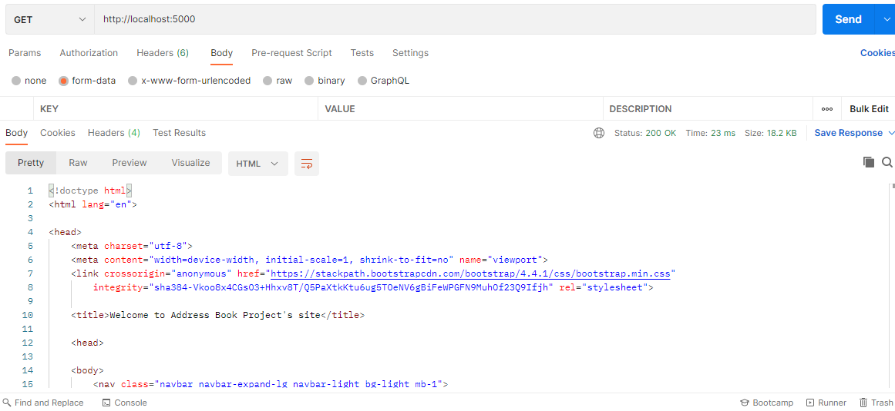
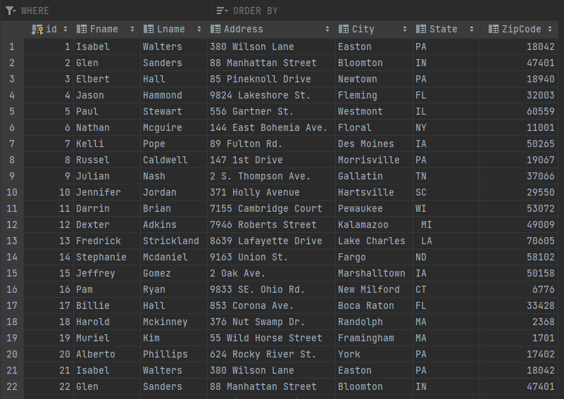

# Project Description
- This is a project assignment to teach how to get Pycharm setup with Docker, Flask, MYSQL, and Postman.
- This project's goal is to use Postman to test GET, POST, PUT, and DELETE request methods.

# Postman Screenshot Whole List

# SQL Data Screenshot Whole List

# Postman Get Request

# Postman Create a New Record

# Postman Edit a Record

# Postman Delete a Record

